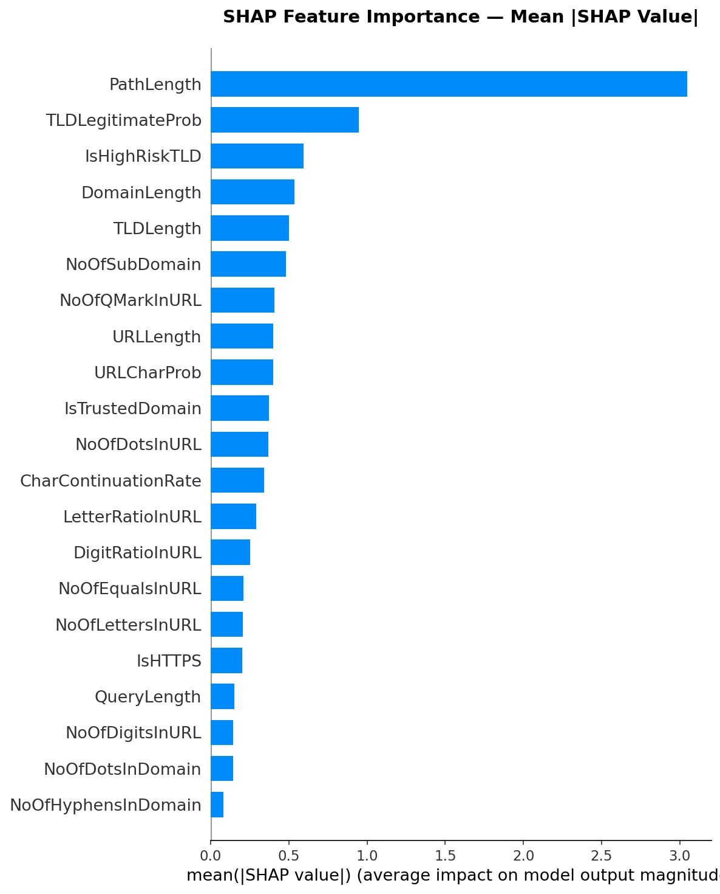
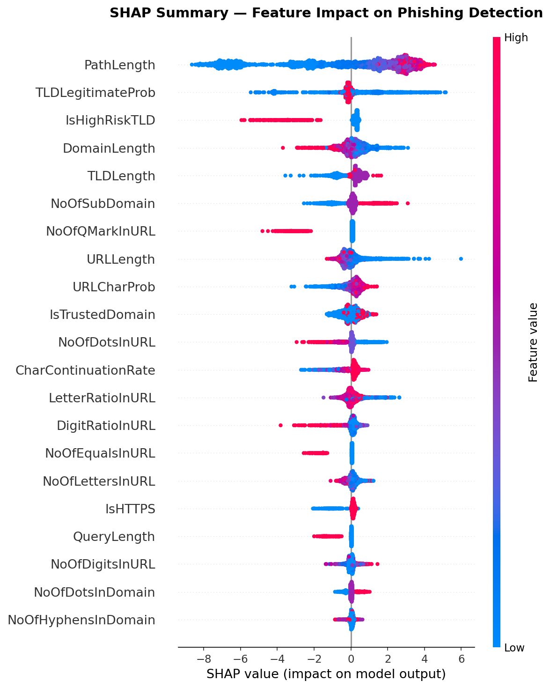
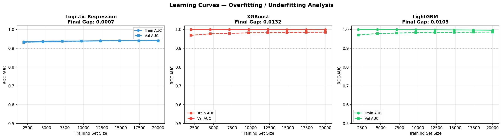

# 🎣 PhreshCatch

**Catching phishing URLs before you click them — using nothing but the URL itself.**

No page visits. No DNS lookups. No HTML parsing. Just 27 features, a very suspicious mind, and 0.4ms to decide.

---

## 🤔 The Problem

Someone just sent you a link.

It could be your bank. It could be PayPal. It could be a Google Doc your colleague shared.

Or it could be `paypa1-secure-login.xyz/verify/your/entire/life`.

The scary part? Both look identical in a WhatsApp message. Blacklists are outdated the moment a new domain is registered. Page scanners require *visiting* the URL — which is exactly what you're trying to avoid. And your eyes? Demonstrably untrustworthy after 47 browser tabs.

**PhreshCatch reads the URL the way a security researcher would** — suspicious of every hyphen, every free TLD, every `?verify=true&account=suspended` — and makes a call in under half a millisecond.

---

## 📌 What This Is

An end-to-end ML pipeline I built to classify URLs as **phishing** or **benign** using 27 hand-engineered features extracted purely from URL structure.

Trained on **PhreshPhish** — a production-grade dataset built from the real browsing traffic of 6 million Webroot users — and tuned to catch **97.74% of phishing URLs** at a threshold chosen for security contexts, where missing a threat costs more than crying wolf.

---

## 🏆 Results

### Baseline — 5 Models, 27 Features, Default Threshold

| Model | Accuracy | ROC-AUC | Missed Phishing | Train Time |
|---|---|---|---|---|
| **XGBoost** | 94.42% | 0.9800 | 2,723 | ~62s |
| LightGBM | 94.16% | 0.9794 | 3,036 | ~57s |
| Random Forest | 93.21% | 0.9749 | 3,320 | ~178s |
| Logistic Regression | 88.23% | 0.9367 | 6,514 | ~62s |
| Decision Tree | 90.10% | 0.9001 | 5,555 | ~54s |

> Random Forest took 178 seconds and still lost to XGBoost. Noted.

### After Optuna Tuning — Threshold 0.57

| Model | ROC-AUC | Missed Phishing | False Alarms | Catch Rate |
|---|---|---|---|---|
| **XGBoost** *(best)* | **0.9804** | **2,062** | **7,555** | **97.74%** |
| LightGBM | 0.9798 | 2,661 | 6,929 | 96.53% |

> **Missed phishing = the metric that actually matters.** A false alarm is annoying. A missed phishing URL is a stolen password, a drained account, a very bad Tuesday.

---

## 🕵️ Three Things I Discovered Along the Way

I started with two other datasets before landing on PhreshPhish. The detour was expensive in time and educational in everything else.

### 🚨 Finding 1 — The Feature That Was Too Good

While experimenting with the PhiUSIIL dataset, I found `URLSimilarityIndex` scored **exactly 100.0 for every single legitimate URL** in the dataset. Every one. Without exception.

A feature that perfectly separates two classes is not a feature. It's a leak. The dataset was constructed in a way that made this column a direct label proxy. Dropped immediately, dataset abandoned.

### 🖼️ Finding 2 — The Model Was Learning Webpage Completeness

PhiUSIIL phishing pages had a median of **0** across nearly all HTML features — `NoOfImage`, `NoOfJS`, `NoOfCSS`, `NoOfExternalRef`. Not because phishing pages are sparse. Because they were scraped as skeleton HTML while legitimate pages were fully loaded.

The model was learning "does this page have images" — not "is this page malicious." Impressive accuracy. Completely wrong reason.

### 🌍 Finding 3 — 99% Accuracy, 23% Recall (Yes, Really)

A model trained on PhiUSIIL was tested on ISCX-URL-2016. It achieved 99%+ accuracy on its own test set and **23% phishing recall** on ISCX. Same model. Different dataset. Complete collapse.

Why? The feature distributions are entirely different:

```
IsHTTPS:          PhiUSIIL phishing=0.49  →  ISCX phishing=0.07
LetterRatio:      PhiUSIIL phishing=0.57  →  ISCX phishing=0.81
CharContinuation: PhiUSIIL phishing=0.73  →  ISCX phishing=0.96
```

ISCX phishing URLs look structurally legitimate. The model had memorized the wrong distribution. This is what domain shift looks like in the wild — and why dataset choice is an architectural decision, not an afterthought.

**Solution:** PhreshPhish. Built from real browsing telemetry. Peer-reviewed. No construction bias.

---

## 📦 Dataset

**[PhreshPhish v1.0.1](https://huggingface.co/datasets/phreshphish/phreshphish)** — July 2024 to December 2025

| Split | Total | Phishing | Benign |
|---|---|---|---|
| Train | 498,255 | 221,526 | 276,729 |
| Test | 168,060 | 76,800 | 91,260 |

- Phishing URLs from **PhishTank**, **APWG eCrime eXchange**, **NetCraft**
- Benign URLs from anonymized browsing telemetry of **6 million real Webroot users**
- Peer-reviewed paper, published July 2025
- Specifically designed to minimize leakage and construction bias

---

## ⚙️ How It Works

```
Any URL
      ↓
Layer 1 — Whitelist (Tranco Top 10K)
      if trusted domain → benign, done
      ↓ otherwise
Layer 2 — URLFeatureExtractor (27 features, no network calls)
      ↓
XGBoost (Optuna-tuned, 30 trials, 3-fold CV on 100K subsample)
      ↓
Decision threshold = 0.57
      ↓
🚨 Phishing  or  ✅ Benign
```

Two layers. The whitelist handles obvious legitimate domains instantly. The ML model handles everything else — suspicious TLDs, hyphen-heavy domains, query parameter stacking, and all the tricks attackers have been recycling since 2003.

```python
import pickle
from src.features import predict_with_override, DECISION_THRESHOLD

pipeline        = pickle.load(open('models/best_pipeline_tuned.pkl', 'rb'))
trusted_domains = pickle.load(open('models/trusted_domains.pkl', 'rb'))

urls = [
    'https://google.com',
    'https://paypal-secure-login.xyz/verify',
    'https://ucion.zaolir.cfd/pageamazon',
]

preds, probs, layers = predict_with_override(pipeline, urls, trusted_domains)

for url, pred, prob, layer in zip(urls, preds, probs, layers):
    label = '🚨 PHISHING' if pred == 0 else '✅ BENIGN'
    print(f"{label} ({prob:.0%})  [{layer}]  {url}")

# ✅ BENIGN   (0%)   [whitelist]  https://google.com
# 🚨 PHISHING (99%)  [ml_model]   https://paypal-secure-login.xyz/verify
# 🚨 PHISHING (98%)  [ml_model]   https://ucion.zaolir.cfd/pageamazon
```

---

## 🛠️ 27 Features

All extracted from the URL string. Not a single network call made.

### Group 1 — URL Structure
| Feature | What it catches |
|---|---|
| `URLLength` | Short throwaway URLs |
| `DomainLength` | Random-looking short domains |
| `TLDLength` | Exotic long TLDs |
| `NoOfSubDomain` | Subdomain stacking abuse |
| `IsHTTPS` | HTTP-only as a weak signal |
| `IsDomainIP` | Raw IP addresses masquerading as domains |

### Group 2 — Path & Query
| Feature | What it catches |
|---|---|
| `PathLength` | Short path = no real content = phishing pattern |
| `QueryLength` | Long query strings with parameter stacking |

### Group 3 — Character Statistics
| Feature | What it catches |
|---|---|
| `NoOfLettersInURL` | Letter count |
| `LetterRatioInURL` | Letter density |
| `NoOfDigitsInURL` | Digit count |
| `DigitRatioInURL` | Digit density |
| `NoOfEqualsInURL` | Query parameter count proxy |
| `NoOfQMarkInURL` | Multiple `?` = multiple redirect layers |
| `NoOfDotsInURL` | Dots across full URL |
| `NoOfDotsInDomain` | Dots in domain only |

### Group 4 — Entropy
| Feature | What it catches |
|---|---|
| `URLCharProb` | Character distribution entropy |
| `CharContinuationRate` | Sequence continuity score |

### Group 5 — Domain Reputation
| Feature | What it catches |
|---|---|
| `TLDLegitimateProb` | How often this TLD appears in benign training data |
| `IsTrustedDomain` | Tranco Top 10K whitelist membership |
| `IsURLShortener` | Known shortener — bypasses whitelist by design |
| `IsHighRiskTLD` | .xyz, .tk, .cfd, .cyou and 20 more known bad actors |
| `NoOfHyphensInDomain` | Hyphen stacking in domain |

### Group 6 — Attack Pattern Signals
| Feature | What it catches |
|---|---|
| `HasAtSymbol` | `http://legit.com@evil.com` — browser ignores everything before @ |
| `HasPhishingKeywordInPath` | Combosquatting where brand is in path not domain |
| `HasBrandInSubdomain` | `paypal.evil.com`, `apple.phishing.xyz` |

### Group 7 — Interaction Features
| Feature | What it catches |
|---|---|
| `HighRiskTLD_x_Hyphens` | Hyphenated domain on known-bad TLD — validated -68 FN at baseline |

> Two other interactions tested and dropped: `HighRiskTLD_x_QMark` and `Shortener_x_URLLength` — no effect on XGBoost. The model was already finding them internally.

---

## 📊 What the Model Actually Learned (SHAP)

| Rank | Feature | Mean \|SHAP\| | Direction |
|---|---|---|---|
| 1 | PathLength | 3.048 | Short path → phishing |
| 2 | TLDLegitimateProb | 0.949 | Rare TLD → phishing |
| 3 | IsHighRiskTLD | 0.596 | High-risk TLD → phishing |
| 4 | DomainLength | 0.535 | Short domain → phishing |
| 5 | TLDLength | 0.500 | Exotic TLD → phishing |
| 6 | NoOfSubDomain | 0.480 | Many subdomains → phishing |
| 7 | NoOfQMarkInURL | 0.409 | Many `?` → phishing |
| 8 | URLLength | 0.402 | Long URL → benign |

**`PathLength` is the biggest finding of this project.** It didn't exist in the original feature set. Adding it restructured the entire SHAP hierarchy — pushing the previous rank 1 (`DomainLength`) down to rank 4. The model learned that URLs with no path or a very short path are overwhelmingly phishing. Real sites have real content. A URL that ends at the domain or has a two-character path is almost always a throwaway.

**Counterintuitive:** long URLs push toward benign, long paths push toward benign — real sites have real content structure. Short, clean URLs with no depth are more suspicious than long ones with real content.




---

## 🎯 Why Threshold 0.57 and Not 0.50

Default sklearn threshold is 0.50 — optimized for balanced accuracy, not security.

| Threshold | Missed Phishing | False Alarms | Catch Rate |
|---|---|---|---|
| 0.50 (default) | 2,690 | 6,728 | 96.50% |
| **0.57 (chosen)** | **2,062** | **7,555** | **97.74%** |

Moving from 0.50 to 0.57 saves **628 phishing URLs** at the cost of 827 additional false alarms — a 1:1.3 tradeoff standard in security tooling.

The math is simple: annoyed users recover. Compromised accounts don't.

---

## 📈 Overfitting Analysis

| Model | Train AUC | Test AUC | Gap | Verdict |
|---|---|---|---|---|
| Logistic Regression | 0.9440 | 0.9368 | 0.0073 | ✅ Good fit |
| Decision Tree | 0.9998 | 0.9001 | 0.0974 | ❌ Memorized the training set |
| Random Forest | 0.9996 | 0.9749 | 0.0247 | ✅ Acceptable |
| XGBoost | 0.9937 | 0.9800 | 0.0137 | ✅ Converging |
| LightGBM | 0.9909 | 0.9768 | 0.0140 | ✅ Converging |

XGBoost and LightGBM are **data-limited, not model-limited** — validation AUC is still rising at 75K training samples in learning curve analysis. More data from PhreshPhish v2 will improve results without a single code change.

Decision Tree achieved 99.98% training AUC and a 0.0974 generalization gap. Overfitting: the one time being overconfident literally costs you.



---

## 🚀 Quickstart

```bash
git clone https://github.com/mallapuabhiraj/phreshcatch
cd phreshcatch
pip install -r requirements.txt
pip install datasets  # one-time only — to download PhreshPhish
```

Run notebooks in order — each saves its outputs for the next:

```
01_baseline_models.py       # downloads data, builds whitelist, trains 5 models
02_optuna_tuning.py         # tunes XGBoost + LightGBM (30 trials each)
03_overfitting_analysis.py  # learning curves + bias-variance verdict
04_shap_explainability.py   # global + local SHAP analysis
05_threshold_analysis.py    # sweep 0.20→0.81, pick operating point
06_stress_test.py           # 6 attack categories, honest blind spot report
```

> Notebook 01 downloads PhreshPhish and saves `data/df_train.csv.gz` and `data/df_test.csv`. All downstream notebooks load from those files — no re-downloading.

---

## 📁 Project Structure

```
phreshcatch/
├── src/
│   └── features.py                 # URLFeatureExtractor + predict_with_override
├── notebooks/
│   ├── 01_baseline_models.py
│   ├── 02_optuna_tuning.py
│   ├── 03_overfitting_analysis.py
│   ├── 04_shap_explainability.py
│   ├── 05_threshold_analysis.py
│   └── 06_stress_test.py
├── models/
│   ├── best_pipeline_tuned.pkl     # XGBoost, 27 features, Optuna-tuned
│   ├── all_tuned_pipelines.pkl     # XGBoost + LightGBM tuned
│   ├── trusted_domains.pkl         # Tranco Top 10K whitelist
│   └── optuna_studies.pkl          # Study objects for analysis
├── data/
│   ├── df_train.csv.gz             # 498K training URLs
│   └── df_test.csv                 # 168K test URLs
├── reports/
│   ├── results_baseline.csv
│   ├── results_tuned.csv
│   ├── stress_test_results.csv
│   └── figures/
│       ├── shap_importance_bar.png
│       ├── shap_summary_beeswarm.png
│       ├── shap_dependence.png
│       ├── shap_waterfall_*.png
│       ├── learning_curves.png
│       └── threshold_analysis.png
├── requirements.txt
└── README.md
```

---

## 🔮 What's Next

**Homoglyph detection** — normalize digit→letter substitutions (g00gle → google) before brand matching. Three stress test misses are waiting for this fix. It's the highest-priority remaining gap.

**Punycode false positive fix** — one legitimate non-Latin domain flagged as phishing. A `IsPunycode` boolean + country-code TLD check would resolve this.

**PhreshPhish v2** — learning curves confirm the model is data-limited. More data, better results, zero architecture changes.

**HTML hybrid model** — combine URL features with lightweight page signals for the clean modern phishing ceiling cases (`docviewer.net`, `securedrive.co`, `teamspace.app`) that URL-string analysis cannot crack. These are architecturally unfixable with URL-only features — the URLs are genuinely clean.

---

## 📋 Requirements

```
scikit-learn
xgboost
lightgbm
optuna
pandas
numpy
shap
matplotlib
requests
```

---

## 📄 License

MIT — use it, extend it, catch some phish.

---

## 🙏 Acknowledgements

- **PhreshPhish** — Webroot Security, 2025
- **PhiUSIIL** — Arvind Prasad & Shalini Chandra, UCI ML Repository, 2024
- **ISCX-URL-2016** — Canadian Institute for Cybersecurity, University of New Brunswick
